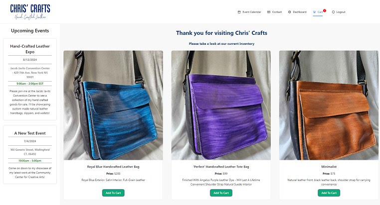
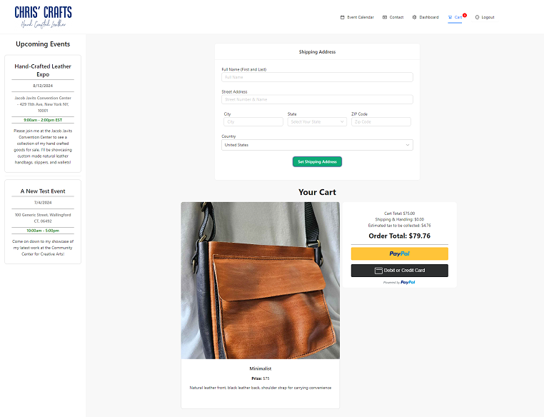

# Chris' Crafts 

## Overview

- An e-commerce style platform where users are easily able to purchase hand-made leather goods

## Features

1. Clean and Simple UI

   - I've implemented Ant Design and inline CSS to this project's UI to create a clean, simple, and user-friendly UI that everyone can enjoy

2. Cart

   - Users have the ability to add their desired items to their cart and check out using PayPal or a Credit Card.

3. Upcoming Events

   - Conveniently placed side-bar to quickly view all details of Chris' upcoming events

4. Event Calendar

   - Implemented an "Event Calendar" link to view more of Chris' events further in the future

5. Contact Form

   - Users can enter their name, email, phone number (optionally), and a detailed message for any inquiries or special requests

6. Shipping Address Form

   - Implemented for a user to set their full name and address for their products to be shipped to

7. Technologies Used

   - Ant Design
   - React
   - MongoDB
   - Mongoose
   - Apollo
   - JWT
   - Cloudinary
   - Multer
   - bcrypt
   - Express
   - GraphQL
   - PayPal
   - Dayjs

## Usage

To view the live application, please visit  
https://chris-crafts.onrender.com

To view this project's repository, please visit  
https://github.com/JoshMassa/chris-crafts

 

When viewing the app on a desktop, the webpage should resemble the following image:

## License

Chris' Crafts © 2024 by Joshua Massa-Pelletier is licensed under 

## Disclaimer

This project is still under development and has not yet been optimized for small or medium devices
